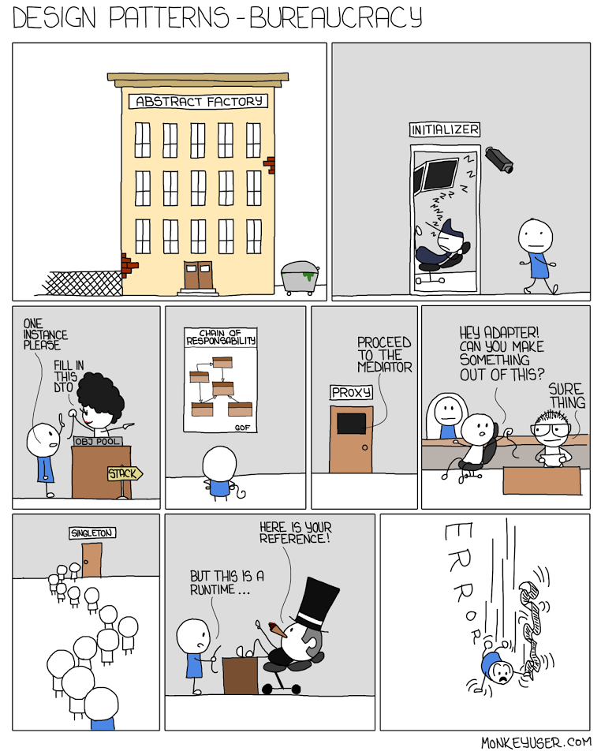

class: center, middle
# Design Patterns in React

Josh Martin

https://cjoshmartin.com

[contact@cjoshmartin.com](mailto:contact@cjoshmartin.com)

---

# Who am I? 

*   Computer Engineering Junior (specializing in Software Design and Embedded Systems) 
*   Minoring Mathematics and Computer Science
*   Spend most of my time programming or dancing

---

# Introduction (1/3)

#### What is a Design Pattern?

A **Design Pattern** is a general repeatable solution to a commonly occurring problem in software design.

A **Anti-Pattern** is a common response to a recurring problem that is usually ineffective and risks being highly counterproductive


---

# Introduction (2/3)

#### Types of Design Patterns

1. Creational

2. Structural

3. Behavioral
---
# Introduction (3/3)

#### History of React (1/2)

.going-deeper[
#### Sources

* [Tom Occhino and Jordan Walke: JS Apps at Facebook](https://www.youtube.com/watch?v=GW0rj4sNH2w)

* [Facebook Engineer | Creator of React.js & Reason](https://www.reactiflux.com/transcripts/jordan-walke/)
* [React.js Conf 2015 Keynote](https://youtu.be/KVZ-P-ZI6W4)
]
* Jordan Walke is credited with creating React.JS 
    - While working at facebook

* React was created inside Facebook's Ads Organization
    - predecessor being [XHP](https://www.facebook.com/notes/facebook-engineering/xhp-a-new-way-to-write-php/294003943919/) (PHP framework)

* Created to improve speed of writing code, managing a huge codebase, and prevent cross site scripting

---
# Introduction (3/3)

#### History of React (2/2)

* React's state is immuablty so that somewhere deep in that app, the views change case a conflict in the state.(a Cascading Update) (provide example)

* React started out being used for the like and comment section of Facebook

* React became open source, out of a need to decouple itself from the Facebook site and be able to let instagram use the framework as well. (finished at JS Conf 2013)
---
# Scope and Immutability 
--

* variables and functions are hoisted in javascript
```javascript
    // expected: ReferenceError: a is not defined
    console.log(a) 
    var a = 1;
```
--
```javascript
    // reality: will return undefined
    var a;
    console.log(a)
    a = 1;
```
---
# Scope and Immutability 
--

 * `var`

--
    - functionally scoped
--

```javascript
    // what we see
    function tacos()
    {
        // ... 

        for (var i=0; i< 1; i++)
        {
            console.log('I like tacos\n')
        }
    }
```
--
```javascript
    // what javascript see
    function tacos()
    {
        var i; // always hoisted to the top of the function

        // ... 

        for (i=0; i< 1; i++)
        {
            console.log('I like tacos\n')
        }
    }
```
---
# Scope and Immutability 

--
 * `gobal variables`

--
    - `var` can became globally scoped, if not inside a function
--

    - Type a variable with out a variable type, that variable will become gobally scoped

```javascript
    (
     function() {
     for (i = 0; i < 1; i++) {i /* does nothing */ }
     } // end of function
    )() // this special syntax tells javascript to run the function immediately 

    // expected: ReferenceError: i is not defined
    // reality: Array starts at 1
    console.log('Array starts at', i) 
 ```
---
# Scope and Immutability 

* How do we this problem of scope?

--
    - use `"use strict";` at the top of your javascript files

```javascript
    "use strict";

    (
     function() {
     for (i = 0; i < 1; i++) {i /* does nothing */ }
     } // end of function
    )() // this special syntax tells javascript to run the function immediately 

    // expected: ReferenceError: i is not defined
    // reality: ReferenceError: i is not defined
    console.log('Array starts at', i) 
```

--
    
* don't use `var` (unless you want a global scope)

--
    - use `let` and `const` instead
---

# Scope and Immutability 
--

 * `let`
    - Blocked scoped
    - **Mutable** meaning the value can be changed later on
--

```javascript
    // what we see
    function tacos()
    {
        // ... 

        for (let i=0; i< 1; i++)
        {
            console.log('I like tacos\n')
        }
    }
```
--
```javascript
    // what javascript see
    function tacos()
    {
        // ... 

        for (let i=0; i< 1; i++)
        {
            console.log('I like tacos\n')
        }
    }
```
---

# Scope and Immutability 

--
 * `const`
    - Blocked scoped
    - **Immutable** meaning the value **cannot** be reassigned later on
---
# Coupling
* React is loosely coupled framework
---
# what an Object is in Javascript

* functions are objects (crazy isn't it?)
---
# Class Keyword
   
* Classes have no since of system composition or type

* Just recently added to javascript in ecmascript 6


https://www.youtube.com/watch?v=Tllw4EPhLiQ
---
## basic example of a class
<iframe width="100%" height="310" src="//jsfiddle.net/cjoshmartin/9LvjLL31/embedded/js,result/" allowpaymentrequest allowfullscreen="allowfullscreen" frameborder="0"></iframe>
---
## Functions
<iframe width="100%" height="400" src="//jsfiddle.net/cjoshmartin/8ehkrrgn/embedded/js,result/" allowpaymentrequest allowfullscreen="allowfullscreen" frameborder="0"></iframe>
---
## Inheritance
<iframe width="100%" height="500" src="//jsfiddle.net/cjoshmartin/hak37x3b/1/embedded/js,result/" allowpaymentrequest allowfullscreen="allowfullscreen" frameborder="0"></iframe>
---
# Inheritance
---
# Composition
---
# Compistion VS. Inhertance     
---
## Surprise!!
* Classes are just abstractions on top of the **Prototype Inheritance Model**

<iframe width="100%" height="400" src="//jsfiddle.net/cjoshmartin/7j8nxod1/embedded/js,result/" allowpaymentrequest allowfullscreen="allowfullscreen" frameborder="0">

https://developer.mozilla.org/en-US/docs/Web/JavaScript/Inheritance_and_the_prototype_chain
---
# what is a Prototype?

* Creational Design Pattern

* Prototypes is how Javscript achieves inheritance


* This Prototype modal allows to use the `new` keyword on our functions and classes in javascript.

* Pure object use the keyword `__proto__`

* functions use the keyword `prototype`
---
# what does the `new` keyword do?
--

* creates an object and check the prototype of whatever it is being called on (e.g. `const josh = new person('Josh');` )

--

* lets create our own

--

```javascript
function new(this_instance)
{
    let obj ={} // 1) create a new object

   Object.setPrototypeof(obj,this_instance.prototype) // 2) set the prototype

// arguments is a reserved keyword
  let args_arr = Array.prototype.slice.apply(arguments)

// returns a class instance  || an obj 
// 3) execute constructor with "this" & (sometimes) return created object
   return this_instance.apply(obj,args_arr.slice(1)) || obj 
}

const josh = new(person, 'Josh');
```

https://youtu.be/Y3zzCY62NYc
---
# Prototype vs Classes


https://developer.mozilla.org/en-US/docs/Web/JavaScript/Guide/Details_of_the_Object_Model
---
## Recreate this using prototypes
<iframe width="100%" height="500" src="//jsfiddle.net/cjoshmartin/hak37x3b/1/embedded/js,result/" allowpaymentrequest allowfullscreen="allowfullscreen" frameborder="0"></iframe>
---
## Create our basic "class"
```javascript
// Basic `class` and defualt constructor
function hello(name){
  this.name = name;
}

// Adding a function to our `class` of `talk`
hello.prototype.talk = function(){
  return `Hello ${this.name}!`
}

// Create a instance and use it!
const say_hello = new hello('Josh');
const selector = document.querySelector('.test-center');
selector.innerHTML = say_hello.talk();
```
---
## Lets extend our basic "class" like normal

<iframe width="100%" height="450" src="//jsfiddle.net/cjoshmartin/kaqxfkLz/embedded/js,result/" allowpaymentrequest allowfullscreen="allowfullscreen" frameborder="0"></iframe>
---
## Lets extand our basic "class" only using prototypes
<iframe width="100%" height="500" src="//jsfiddle.net/cjoshmartin/8m3hon57/embedded/js,result/" allowpaymentrequest allowfullscreen="allowfullscreen" frameborder="0"></iframe>
---
# State
---
# Obserables
---
class: center, middle
# Just so you know...
---
class: center, middle
# if you didnt know
---
# React is a MVC framework

- Comparable to the Observer Pattern
- (define what MVC is!)
---
# Factories
---
 
---
# End
