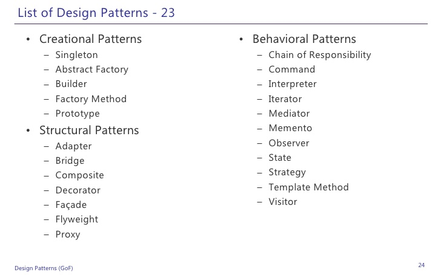
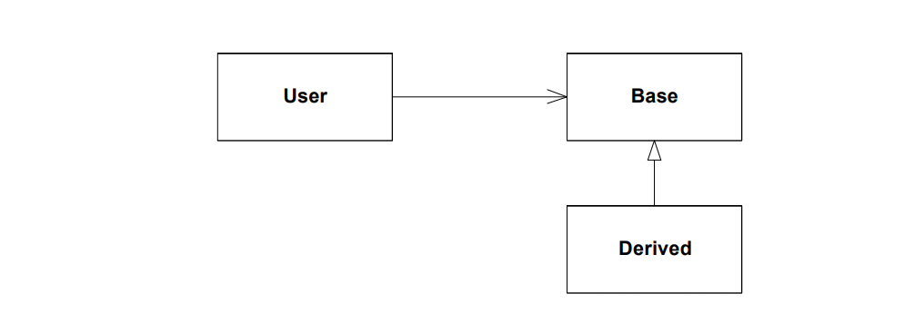
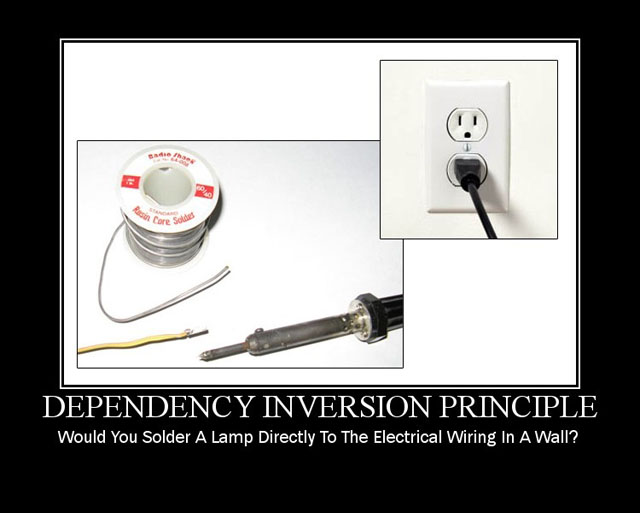
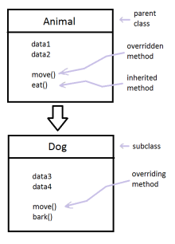
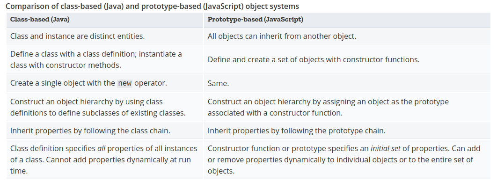
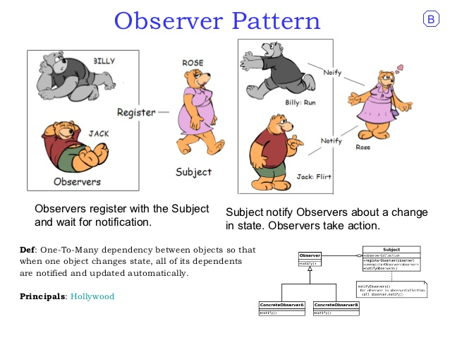

class: center, middle
# Design Patterns in React

Josh Martin
---

# Introduction

#### What is a Design Pattern?

* A **Design Pattern** is a general repeatable solution to a commonly occurring problem in software design.

* Design Patterns is all about writing clean, reuseable code.
---

# Introduction

#### What is a Design Pattern?

* Each Design Pattern has four parts:
    - **Pattern name** a handle we can use to describe a design pattern, its solution and cosequences in a word or two.

    - **Problem** describes when to use the pattern. Explains the problem and its context.

    - **Solution** provides an abstract description of a problem and how a general arrangement of elements solves it.
    - **Consequences** the results and trade-offs of applying the pattern (often space or time trade-offs).
---

# Introduction 

#### Types of Design Patterns

1. **Creational**
    -   Concerned with the process of creating objects

2. **Structural**
    - concerned with the structure of objects

3. **Behavioral**
    - concerned with how objects interact
---

---
# Introduction

#### Understanding SOLID Priniciples of Object Oriented Design
* **S**ingle Responsibility 

* **O**pen-close Priniciples 

* **L**iskov Substitution

* **I**nterface Segregation 

* **D**epndecy Inversion 
---

# Introduction

#### Understanding SOLID Priniciples of Object Oriented Design
* **Single Responsibility**
    -   A class/function should only have one job

* **Open-close Priniciples**
    -   Objects should be open for extension, but closed for modification.

    -   Able to add new features/compenents without breaking code.

    -   Shouldn't introduce breaking changes to existing code.
---

# Introduction

#### Understanding SOLID Priniciples of Object Oriented Design

* **Liskov Substitution**
    

    - Derived classes should swapable with the class(es) it inheritances from (it's base class).

    - The user of the base class should continue to function, if a derived class is passed instead. 
---

# Introduction

#### Understanding SOLID Priniciples of Object Oriented Design

* **Interface Segregation**
    - A client should never be forced to implement an interface that it doesn't use 

    - Should not be forced to depend on methods it does not use.

---

# Introduction

#### Understanding SOLID Priniciples of Object Oriented Design

* **Dependency Inversion** (Dependency injection) 

    - High level modules must not depend on the low level module, but they should depend on abstractions.
.center[

]
---
# Introduction

#### Principles of Rotton Design

   Code is always beautiful, when it is new. 

However, as the code ages it can to begin to rotton, form a few ugly warts, and a few bad hacks.
---
# Introduction

#### Principles of Rotton Design
* **Rigidity** is how difficult is your software is to change

* **Fragility** is tendency to break when someone changes the code

* **Immoibility** inability to be reused in other project

* **Viscosity** how hard is it to use
.center[
[Great Article on Rotton Design](http://www.cvc.uab.es/shared/teach/a21291/temes/object_oriented_design/materials_adicionals/principles_and_patterns.pdf)]
---
# State

--
* Behavioral design pattern

* React has both Stateful and Stateless Components

.center[


]
---
## Stateless (Functional Based Components)

* uses `render`, `props`, and `context`

* A lot of times used as a View

```javascript
export const props_Tacos = (props) => {
    return (
        <div>
        {props.has_tacos}
        </div>
    )
} 
```
---
## Stateful (Class Based Components)

* uses `render`, `state`, and `lifecycle methods`

* A lot of times used as a Controller
```javascript
export default class Tacos extends Component {

    constructor(props){
        super(props);
        this.state ={
        has_tacos: false,
        }
    }

    render(){ 
    
    return( <props_Tacos {... this.state} />
    
    );
 }
}
```
.center[[Cool Video on State](https://www.youtube.com/watch?v=YaZg8wg39QQ)]
---
# Scope and Immutability 
--

* variables and functions are hoisted in javascript
```javascript
    // expected: ReferenceError: a is not defined
    console.log(a) 
    var a = 1;
```
--
```javascript
    // reality: will return undefined
    var a;
    console.log(a)
    a = 1;
```
---
# Scope and Immutability 
--

 * `var`

--
    - functionally scoped
--

```javascript
    // what we see
    function tacos()
    {
        // ... 

        for (var i=0; i< 1; i++)
        {
            console.log('I like tacos\n')
        }
    }
```
--
```javascript
    // what javascript see
    function tacos()
    {
        var i; // always hoisted to the top of the function

        // ... 

        for (i=0; i< 1; i++)
        {
            console.log('I like tacos\n')
        }
    }
```
---
# Scope and Immutability 

--
 * `gobal variables`

--
    - `var` can became globally scoped, if not inside a function
--

    - Type a variable with out a variable type and that variable will become gobally scoped

```javascript
    (
     function() {
     for (i = 0; i < 1; i++) {i /* does nothing */ }
     } // end of function
    )() // this special syntax tells javascript to run the function immediately 

    // expected: ReferenceError: i is not defined
    // reality: Array starts at 1
    console.log('Array starts at', i) 
 ```
---
# Scope and Immutability 

* How do we this problem of scope?

--
    - use `"use strict";` at the top of your javascript files

```javascript
    "use strict";

    (
     function() {
     for (i = 0; i < 1; i++) {i /* does nothing */ }
     } // end of function
    )() // this special syntax tells javascript to run the function immediately 

    // expected: ReferenceError: i is not defined
    // reality: ReferenceError: i is not defined
    console.log('Array starts at', i) 
```

--
    
* Don't use `var` 

--
    - use `let` and `const` instead
---

# Scope and Immutability 
--

 * `let`
    - Blocked scoped
    - doesn't add on properties to the gobal object (e.g. window), like `var` does
    - **Mutable** meaning the value can be changed later on
--

```javascript
    // what we see
    function tacos()
    {
        // ... 

        for (let i=0; i< 1; i++)
        {
            console.log('I like tacos\n')
        }
    }
```
--
```javascript
    // what javascript see
    function tacos()
    {
        // ... 

        for (let i=0; i< 1; i++)
        {
            console.log('I like tacos\n')
        }
    }
```

---

# Scope and Immutability 

--
 * `const`
    - Blocked scoped
    - **Immutable** meaning the value **cannot** be reassigned later on

```javascript
    const immutable = 'nana-a-boo-boo, you cannot change my value';
    
    immutable = 'I will try'; // TypeError: Assignment to constant variable.
```

https://scotch.io/tutorials/understanding-hoisting-in-javascript
---

# Scope and Immutability 

*   Immutability is a great feature
    - In React, `props` are immutable. Which prevents a conflict in their shared state.
    - One way data flow 
--

.center[]
---
# Scope and Immutability 

*   Immutability is a great feature
    - In React, `props` are immutable. Which prevents a conflict in their shared state.
    - One way data flow 


---

# Scope and Immutability 

*   Immutability is a great feature
    - In React, `props` are immutable. Which prevents a conflict in their shared state.
    - One way data flow 


.center[]
---
# Coupling
--

* React is loosely coupled framework
--

* **Coupling** is the degree of interdependence between software modules.

    - Tighly Coupled
    - Loosely Coupled
--

*  **Cohesion** is the degree of which elements inside a component belong together

    - Loosely Coupling -> High Cohesion
    - Tighly Coupled -> Low Cohesion
---
<!---
# what an Object is in Javascript

* functions are objects (crazy isn't it?)

--->

# Class Keyword
   

* Just recently added to javascript in ECMAScript 6


https://www.youtube.com/watch?v=Tllw4EPhLiQ
---
## basic example of a class
<iframe width="100%" height="310" src="//jsfiddle.net/cjoshmartin/9LvjLL31/embedded/js,result/" allowpaymentrequest allowfullscreen="allowfullscreen" frameborder="0"></iframe>
---
## Functions
<iframe width="100%" height="400" src="//jsfiddle.net/cjoshmartin/8ehkrrgn/embedded/js,result/" allowpaymentrequest allowfullscreen="allowfullscreen" frameborder="0"></iframe>
---
## Inheritance
<iframe width="100%" height="500" src="//jsfiddle.net/cjoshmartin/hak37x3b/1/embedded/js,result/" allowpaymentrequest allowfullscreen="allowfullscreen" frameborder="0"></iframe>
---
# Inheritance
    
* When an object is derived from another object

* "Is A" relationship 

* Often Inheritance breaks encapsulation.

    - implementation of a subclass becomes tied up with implementation of its parent. Any changes to the parent will cause changes to the subclass. 

.center[]
---
# Composition

* Type of Aggregation
    - **Aggregation** is when compose a component such that it made of up of other component

    - "Has a" relationship

* focused on what a things does and not how things are related

* Allows for more complex functionality

```html
<App>

    <Header /> 
    <Router>

        <Main />
        <About />
        <Projects />

    </Router>

</App>
```
---
# Composition VS Inheritance


* Should not have to create new components to achieve reuse.

* Should be able to achieve all functionally needed through composing existing components.

* Helps keep classes encapsulated and focused on one task.

* Reuse by inheritance makes it easier to composes new components by building onto old ones.

---
## Surprise!!
* Classes are just abstractions on top of the **Prototype Inheritance Model**

* But what is a Prototype??
---
# what is a Prototype?

* Creational Design Pattern

* Creating new objects by cloning other objects

* Prototypes is how Javscript achieves inheritance


* This Prototype modal allows to use the `new` keyword on our functions and classes in javascript.

    - creates an object and check the prototype of whatever it is being called on (e.g. `const josh = new person('Josh');` )

* functions use the keyword `prototype`
---
# Prototype vs Classes


.center[
[More Detail here](https://developer.mozilla.org/en-US/docs/Web/JavaScript/Guide/Details_of_the_Object_Model)]
---
## Recreate this using prototypes
<iframe width="100%" height="500" src="//jsfiddle.net/cjoshmartin/hak37x3b/1/embedded/js,result/" allowpaymentrequest allowfullscreen="allowfullscreen" frameborder="0"></iframe>
---
## Create our basic "class"
```javascript
// Basic `class` and defualt constructor
function hello(name){
  this.name = name;
}

// Adding a function to our `class` of `talk`
hello.prototype.talk = function(){
  return `Hello ${this.name}!`
}

// Create a instance and use it!
const say_hello = new hello('Josh');
const selector = document.querySelector('.test-center');
selector.innerHTML = say_hello.talk();

```
---
## Lets extend our basic "class" like normal

<iframe width="100%" height="450" src="//jsfiddle.net/cjoshmartin/kaqxfkLz/embedded/js,result/" allowpaymentrequest allowfullscreen="allowfullscreen" frameborder="0"></iframe>
---
## Lets extand our basic "class" only using prototypes
<iframe width="100%" height="500" src="//jsfiddle.net/cjoshmartin/8m3hon57/embedded/js,result/" allowpaymentrequest allowfullscreen="allowfullscreen" frameborder="0"></iframe>
---
# Factories

* Creational Pattern

* Use to deal with creating objects or components.

```javascript
// ./main.js (before)

import Home          from './app/screens';
import LoginScreen   from './app/screens';
import SignupScreen  from './app/screens';
import ProfileScreen from './app/screens';
```
```javascript
// ./app/screens/index.js

export { default as Home}           from "./Home"
export { default as LoginScreen }   from "./LoginScreen"
export { default as ProfileScreen } from "./ProfileScreen"
export { default as SignupScreen }  from "./SignupScreen"
```
```javascript
// ./main.js (after)

import {Home, LoginScreen, SignupScreen, ProfileScreen } from './app/screens'

```
---
# Adapter

* Structural Pattern

* Converts  one type of object to another type of object that the client expects

* Make up of:
    - **Target** which is the object the client interacts

    - **Adaptee** what the client wants to interact with but can not  

    - **Adapter** makes the connection between the Target and Adaptee
---
# Adapter

* Babel (JSX -> plain JS)

```javascript
class Hello extends React.Component {
  render() {
    return <div>Hello {this.props.toWhat}</div>;
  }
}

ReactDOM.render(
  <Hello toWhat="World" />,
  document.getElementById('root')
);
```
---
# Adapter
```javascript
class Hello extends React.Component {
  render() {
    return React.createElement('div', null, `Hello ${this.props.toWhat}`);
  }
}

ReactDOM.render(
  React.createElement(Hello, {toWhat: 'World'}, null),
  document.getElementById('root')
);
```
.center[[Try it for yourself here](https://babeljs.io/repl/#?presets=react&code_lz=GYVwdgxgLglg9mABACwKYBt1wBQEpEDeAUIogE6pQhlIA8AJjAG4B8AEhlogO5xnr0AhLQD0jVgG4iAXyJA)]
---
# Observer

* Behavioral Pattern

* Used when you have many other objects that need to receive updates when another object changes
    - **Subject** maintains a list of dependents

    - **Observers** are what the subject notifies of any state change automatically

* the Subject does not need to know about the observers.

* Key part in MVC architectural
---
class: center,middle

---

.center[
# End
@cjoshmartin

[cjoshmartin.com](http://www.cjoshmartin.com)

[contact@cjoshmartin.com](mailto:contact@cjoshmartin.com)

]
